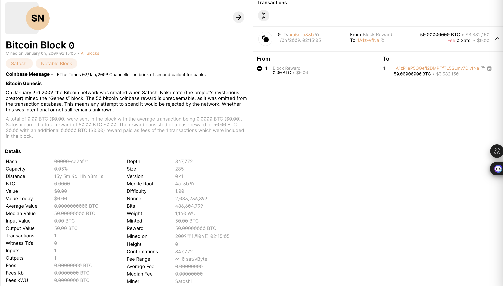

# 比特币的认识

## 比特币的诞生
2008年，一个名字叫Satoshi Nakamoto的人，在一个加密技术邮件列表发布比特币白皮书：“比特币：一种点对点的电子现金系统（Bitcoin: A Peer-to-Peer Electronic Cash System）”。
2009年1月3号，比特币的首个区块诞生，并在首个区块中记录了当天泰晤士报的头版标题：“The Times 03/Jan/2009 Chancellor on brink of second bailout for banks（财政大臣考虑再次紧急援助银行危机）”

## 比特币的重要概念

### 非对称加密
所谓非对称加密，其实很简单，就是加密和解密需要两把钥匙：一把公钥和一把私钥。公钥是公开的，任何人都可以获取。私钥是保密的，只有拥有者才能使用。他人使用你的公钥加密信息，然后发送给你，你用私钥解密，取出信息。反过来，你也可以用私钥加密信息，别人用你的公钥解开，从而证明这个信息确实是你发出的，且未被篡改，这叫做数字签名。
当使用你的公钥加密一笔资产的时候，因为私钥在你那里，所以你可以自由的操作这笔资产，别人没有你的私钥，无法操作你的资产。

### 哈希算法
在比特币系统中，哈希算法绝对是一个非常重要的一个核心，使用也是比较多的，所以一定有必要了解哈希算法。
**哈希算法**，又称散列算法，它是一个**单向函数**，可以把**任意长度**的输入数据转化为**固定长度**的输出。
在比特币系统中，交易会用哈希，区块会用哈希，工作量证明会用哈希算法。

### 钱包
现实世界中，你的钱存在哪里呢，答，钱包。比特币也是一样的，比特币也存在钱包中。比特币钱包就是一个软件，里面保存了所有你的比特币，你可以用这个软件来管理你的比特币。实际上，比特币钱包中存放的是你的公钥和私钥。根据协议，公钥的长度是512位。这个长度不太方便传播，因此协议又规定，要为公钥生成一个160位的指纹。所谓指纹，就是一个比较短的、易于传播的哈希值。160位是二进制，写成十六进制，大约是26到35个字符，比如 1BvBMSEYstWetqTFn5Au4m4GFg7xJaNVN2。这个字符串就叫做钱包的地址，它是唯一的，即每个钱包的地址肯定都是不一样的。
你向别人收钱时，只要告诉对方你的钱包地址即可，对方向这个地址付款。由于你是这个地址的拥有者（你拥有该地址的私钥），所以你会收到这笔钱。

### 区块的结构体和链式结构
比特币中区块的结构如下：

主要分为**区块头**和**区块体**。区块头中包含了当前区块的一些特征，主要包含当前区块的哈希值，前一个区块的哈希值，区块的生成时间，区块的难度，区块的nonce值，区块体中包含了交易信息；区块体中包含的交易信息，交易信息中包含交易发起方，交易接收方，交易金额，交易时间，交易签名。

区块链是由一个一个区块构成的有序链表，每一个区块都记录了一系列交易，并且，每个区块都指向前一个区块，从而形成一个链条：结构如下

可以参考[blockchaindemo](https://blockchaindemo.io/)，真实比特币可以参考[blockchain.com](https://www.blockchain.com/explorer/assets/btc)

### UTXO模型
比特币是一个公开的账本，记账方式并不是使用传统的账户模式，我们观察任何一个交易，它总是由若干个输入（Input）和若干个输出（Output）构成，一个Input指向的是前面区块的某个Output，只有Coinbase交易（矿工奖励的铸币交易）没有输入，只有凭空输出。所以，任何交易，总是可以由Input溯源到Coinbase交易。还没有被下一个交易花费的Output被称为UTXO：Unspent TX Output，即未花费交易输出。比特币的交易模型和我们平时使用的银行账号有所不同，它并没有账户这个说法，只有UTXO。想要确定某个人拥有的比特币，并无法通过某个账户查到，必须知道此人控制的所有UTXO金额之和。

### POW 工作量证明
工作量证明也用到了哈希算法，区块的结构中有一个difficulty值和nonce值，nonce值是随机的， difficulty值是固定的， 区块上信息和nonce值一起可以计算出一个哈希值，我们通过判断这个哈希值开头0的个数和difficulty值是否相等，如果相等，则证明工作量证明成功，否则继续改变nonce值，直到成功。这个过程我们会贡献计算能力和电力等资源，就像矿工付出时间体力一样，所以这个过程也叫挖矿。

### P2P网络
P2P网络是区块链的基础，区块链的区块是存储在区块链节点中的，区块链节点是区块链的参与者，区块链节点之间是P2P网络，区块链节点之间通过网络传输区块，实现区块链的共识。比特币是一个全世界的开放网络，只要你有服务器，就能加入这个网络，成为一个节点。每个节点都包含了整个区块链，并且节点之间时刻不停地在同步信息。
当你发生了一笔支付，你所在的节点就会把这笔交易告诉另一个节点，直至传遍整个网络。矿工从网上收集各种新发生的交易，将它们打包写入区块链。一旦写入成功， 矿工所在节点的区块链，就成为最新版本，其他节点都会来复制新增的区块，保证全网的区块链都是一致的。
最后，你所在的节点也拿到了最新的区块链，从而得知你早先的那笔交易，已经写在里面了，至此交易确认成功。

## 关于比特币的一些感受
也行有人会问题，比特币的本质是什么，真的有价值吗。
说到底，比特币系统只是网路中的一个开源软件，人人都可以下载的软件，人人都可以使用的软件，而比特币系统只是这个软件中的产物，真的有价值吗。
这个问题唤起了我小时候的回忆，小时候生活在农村，家里会养一些鸡鸭鹅，它们长大了会杀掉吃肉肉，但是他们的羽毛是我们这些小朋友最喜欢的了，我们会都收集起来，去到一个专门的地方去换糖。羽毛有价值吗，没有~，那为什么我们还能用羽毛换糖呢，他能接受羽毛给我们糖，说明他也认可羽毛的价值。那羽毛是货币吗，从某种角度来说答案可以是yes，只要参与方都认可的东西就可以作为货币，这就是共识。现在全世界的人们普遍的一个共识，那就是黄金，只要你手里有黄金一定能在任何地方换到你想到的东西。比特币正在向上冲刺，我坚信比特币会是下一个全世界的共识。所以如果你还问我比特币有价值吗。我的答案毫无疑问yes。

